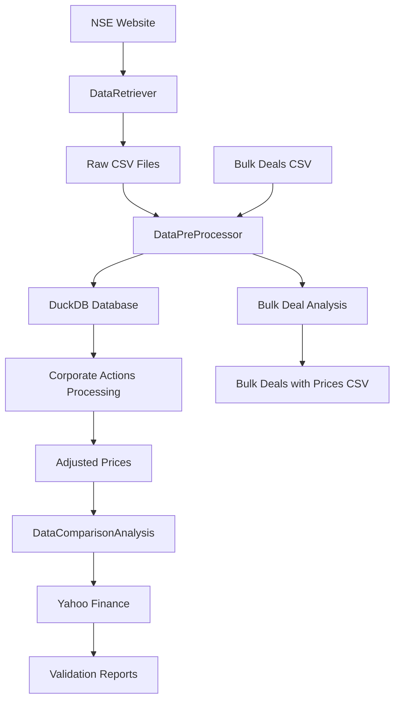

# NSE Financial Data Processing & Analysis Pipeline

A comprehensive Python-based system for downloading, processing, and analyzing NSE (National Stock Exchange) financial data with corporate action adjustments and bulk deal analysis.

## 🎯 Overview

This project provides a complete pipeline for:
- **Data Retrieval**: Automated downloading of NSE historical data (BHAV, securities delivery, bulk deals)
- **Data Processing**: Corporate actions processing with dividend, bonus, and split adjustments
- **Price Adjustment**: Calculation of adjusted closing prices considering corporate actions
- **Bulk Deal Analysis**: Processing and analysis of bulk trading transactions
- **Data Comparison**: Validation against Yahoo Finance data
- **Comprehensive Testing**: Extensive test suite for data validation

## 📁 Project Structure

```
Code/
├── requirements.txt            # Requirements for the project
├── main.py                     # Main execution script
├── DataRetriever.py            # NSE data downloading module
├── DataPreProcessor.py         # Data processing & corporate actions
├── DataComparisonAnalysis.py   # Data validation & comparison
├── data/                       # Data storage directory
│   ├── eod.duckdb              # Main DuckDB database
│   ├── bhav/                   # BHAV price data files
│   ├── sec_del/                # Securities delivery data
│   ├── bhav_sec/               # Securities BHAV data
│   ├── CF-CA-equities.csv      # Corporate Actions data (pulled from NSE - required)
│   ├── Bulk-Deals.csv          # Bulk Deals data (pulled from NSE - required)
└── └── *.csv                   # Processed CSV outputs
```

## 🚀 Quick Start

### Prerequisites

```bash
pip install -r requirements.txt
```

### Basic Usage

```python
import duckdb
from main import main

# Set parameters
fromDate = '2025-01-01'
toDate = '2025-07-01'
tickerDict = {}  # Add specific tickers if needed - required for some functions
create_database = True  # Set to True for first run

# Connect to database
con = duckdb.connect(database='data/eod.duckdb', read_only=False)

# Run the pipeline
main(fromDate, toDate, tickerDict, con, create_database)
con.close()
```

## 📊 Core Components

### 1. DataRetriever.py
**Purpose**: Downloads historical data from NSE website

**Key Features**:
- Supports multiple data types: `bhav`, `sec_del`, `bhav_sec`, etc.
- Automatic date range handling with business day filtering
- Retry mechanism with configurable sleep intervals
- Parallel downloads with progress tracking
- ZIP file extraction and processing

**Supported Data Types**:
```python
dictKeys = ['sec_del', 'bhav', 'bhav_sec']
# Additional: 'equity_info', 'hist_data', 'ipo_eq', 'nse_oi', 'trade_info'
```

**Key Methods**:
- `download_and_save_file()`: Downloads individual files
- `retrieve_bhav_data()`: Main download orchestrator
- `create_oldBhav()`, `create_secDel()`, `create_newBhav()`: Database table creation
- `create_finalDB()`: Merges datasets into comprehensive database

### 2. DataPreProcessor.py
**Purpose**: Processes raw data and applies corporate action adjustments

**Key Features**:
- **Corporate Actions Processing**: Handles dividends, bonuses, splits, rights issues
- **Price Adjustment Calculation**: Applies cumulative adjustment factors
- **Bulk Deal Processing**: Analyzes bulk trading transactions
- **Data Validation**: Ensures data integrity and consistency

**Corporate Actions Supported**:
- **Dividends**: Adjusts prices by dividend amount
- **Stock Splits**: Applies split ratios (e.g., 1:2, 1:5)
- **Bonus Issues**: Calculates bonus ratios (e.g., 1:1, 3:2)
- **Rights Issues**: Basic rights issue handling

**Adjustment Formula**:
```python
# Dividend Adjustment
multiplier = (prev_close - dividend) / prev_close

# Split Adjustment  
multiplier = split_to / split_from

# Bonus Adjustment
multiplier = bonus_to / (bonus_from + bonus_to)

# Final Adjusted Price
adj_close = close_price * cumulative_factor
```

**Key Methods**:
- `fetch_corporate_actions()`: Retrieves corporate actions data
- `preprocess_ca()`: Processes corporate actions with regex parsing
- `calculate_adjusted_prices()`: Calculates adjusted closing prices
- `process_bulk_deals()`: Analyzes bulk deal transactions

### 3. DataComparisonAnalysis.py
**Purpose**: Validates processed data against external sources

**Key Features**:
- **Yahoo Finance Comparison**: Validates adjusted prices
- **Data Quality Metrics**: Calculates accuracy percentages
- **Overlap Analysis**: Identifies common data periods
- **Error Detection**: Highlights discrepancies and anomalies
- **Performance Metrics**: Provides detailed statistics

**Comparison Metrics**:
- Price accuracy percentages
- Volume correlation analysis
- Date range overlaps
- Missing data identification
- Statistical variance analysis

## 🗄️ Database Schema

### Core Tables

#### bhav_complete_data
```sql
CREATE TABLE bhav_complete_data (
    SYMBOL VARCHAR,
    SERIES VARCHAR,
    DATE1 DATE,
    PREV_CLOSE DOUBLE,
    OPEN_PRICE DOUBLE,
    HIGH_PRICE DOUBLE,
    LOW_PRICE DOUBLE,
    LAST_PRICE DOUBLE,
    CLOSE_PRICE DOUBLE,
    AVG_PRICE DOUBLE,
    TTL_TRD_QNTY BIGINT,
    TURNOVER_LACS DOUBLE,
    NO_OF_TRADES BIGINT,
    DELIV_QTY BIGINT,
    DELIV_PER DOUBLE,
    DATA_SOURCE VARCHAR,
    PRIMARY KEY (SYMBOL, SERIES, DATE1)
);
```

#### bhav_adjusted_prices
```sql
CREATE TABLE bhav_adjusted_prices (
    SYMBOL VARCHAR,
    SERIES VARCHAR,
    DATE1 DATE,
    PREV_CLOSE DOUBLE,
    OPEN_PRICE DOUBLE,
    HIGH_PRICE DOUBLE,
    LOW_PRICE DOUBLE,
    LAST_PRICE DOUBLE,
    CLOSE_PRICE DOUBLE,
    ADJ_CLOSE_PRICE DOUBLE,  -- Adjusted for corporate actions
    AVG_PRICE DOUBLE,
    TTL_TRD_QNTY BIGINT,
    TURNOVER_LACS DOUBLE,
    NO_OF_TRADES BIGINT,
    DELIV_QTY BIGINT,
    DELIV_PER DOUBLE,
    PRIMARY KEY (SYMBOL, SERIES, DATE1)
);
```

#### corporate_actions
```sql
CREATE TABLE corporate_actions (
    symbol VARCHAR,
    ex_date DATE,
    action_type VARCHAR,
    dividend_amount DOUBLE,
    bonus_ratio_from DOUBLE,
    bonus_ratio_to DOUBLE,
    split_ratio_from DOUBLE,
    split_ratio_to DOUBLE,
    PRIMARY KEY (symbol, ex_date, action_type)
);
```

#### bulk_deals
```sql
CREATE TABLE bulk_deals (
    Date DATE,
    Symbol VARCHAR,
    Security_Name VARCHAR,
    Client_Name VARCHAR,
    Buy_Sell VARCHAR,
    Quantity_Traded BIGINT,
    Trade_Price DOUBLE,
    Remarks VARCHAR
);
```

## 🔧 Configuration

### Date Range Configuration
```python
# In main.py
fromDate = '2025-01-01'  # Start date (YYYY-MM-DD)
toDate = '2025-07-01'    # End date (YYYY-MM-DD)
```

### Ticker Dictionary (Optional)
```python
tickerDict = {
    '360ONE': '360ONE.NS',
    'CIEINDIA': 'CIEINDIA.NS',
    'CRISIL': 'CRISIL.NS',
    'DCMSRIND': 'DCMSRIND.NS',
}
```

### Data Source Selection
```python
# In DataRetriever.py
dictKeys = ['sec_del', 'bhav', 'bhav_sec']  # Data types to download
DOWNLOAD_ALL_KEYS = True  # Download all specified keys
```

## 📈 Usage Examples

### 1. Complete Pipeline Execution
```python
# First time setup - downloads and processes all data
create_database = True
main(fromDate, toDate, tickerDict, con, create_database)
```

### 2. Process Bulk Deals Only
```python
from DataPreProcessor import DataPreProcessor

pre_processor = DataPreProcessor(fromDate, toDate, tickerDict, con)
pre_processor.process_bulk_deals()
```

### 3. Corporate Actions Processing
```python
pre_processor = DataPreProcessor(fromDate, toDate, tickerDict, con)
pre_processor.preprocess_ca()
pre_processor.calculate_adjusted_prices()
```

### 4. Data Comparison Analysis
```python
from DataComparisonAnalysis import DataComparisonAnalysis

analysis = DataComparisonAnalysis(fromDate, toDate, tickerDict, con)
analysis.compare_adj_close()
```

## 📋 Output Files

The pipeline generates several output files in the `data/` directory:

- **eod.duckdb**: Main database file
- **bhav_complete_data.csv**: Merged price data
- **bhav_adjusted_prices.csv**: Corporate action adjusted prices
- **corporate_actions_processed.csv**: Processed corporate actions
- **bulk_deals_with_prices.csv**: Bulk deals with price analysis
- **yfin_vs_bhav_comparison_*.csv**: Yahoo Finance comparison results

## 🧪 Testing & Validation

The `tests/` directory contains comprehensive validation scripts:

### Data Quality Tests
- `check_schema.py`: Database schema validation
- `check_duplicates.py`: Duplicate record detection
- `check_matching_data.py`: Data consistency checks
- `verify_primary_keys.py`: Primary key constraint validation

### Corporate Actions Tests
- `check_corporate_actions.py`: Corporate actions validation
- `test_ca_impact.py`: Corporate action impact analysis
- `check_adjustments.py`: Price adjustment verification

### Integration Tests
- `test_full_pipeline.py`: End-to-end pipeline testing
- `test_single_export.py`: Single stock analysis
- `pipeline_status.py`: Pipeline health monitoring

### Usage Example
```bash
python tests/test_full_pipeline.py
python tests/check_schema.py
python tests/verify_export.py
```

## 🚨 Error Handling

The system includes comprehensive error handling:

### Common Issues & Solutions

1. **Date Format Errors**
   ```python
   # Ensure dates are in YYYY-MM-DD format
   fromDate = '2025-01-01'  # ✅ Correct
   fromDate = '01-01-2025'  # ❌ Incorrect
   ```

2. **Database Connection Issues**
   ```python
   # Always ensure proper database connection
   con = duckdb.connect(database='data/eod.duckdb', read_only=False)
   # Remember to close connection
   con.close()
   ```

3. **Missing Data Files**
   ```bash
   # Ensure required CSV files exist:
   # - data/CF-CA-equities.csv (Corporate actions)
   # - data/Bulk-Deals.csv (Bulk deals)
   ```

4. **Memory Issues**
   ```python
   # For large datasets, process in chunks
   # Adjust batch sizes in DataRetriever configuration
   ```

## 🔄 Data Flow



## 📊 Performance Considerations

### Optimization Tips

1. **Database Indexing**: Primary keys are automatically indexed
2. **Batch Processing**: Large datasets are processed in chunks
3. **Memory Management**: Temporary tables are properly cleaned up
4. **Parallel Downloads**: Multiple files downloaded concurrently

### System Requirements

- **RAM**: Minimum 4GB (8GB recommended for large datasets)
- **Storage**: ~1GB per year of data
- **Network**: Stable internet connection for NSE data downloads
- **Python**: 3.8+ recommended

## 🤝 Contributing

### Development Setup
```bash
git clone <repository-url>
cd Code
pip install -r requirements.txt  # If requirements.txt exists
```

### Code Style
- Follow PEP 8 standards
- Add comprehensive docstrings
- Include error handling
- Write unit tests for new features

## 📄 License

This project is for educational and research purposes. Please ensure compliance with NSE data usage policies.

## 🆘 Support

For issues and questions:
1. Check the `tests/` directory for validation scripts (TODO)
2. Review error logs in console output
3. Verify data file formats and locations
4. Ensure all dependencies are installed

## 🔗 Related Resources

- [NSE Official Website](https://www.nseindia.com/)
- [DuckDB Documentation](https://duckdb.org/docs/)
- [Yahoo Finance API](https://pypi.org/project/yfinance/)
- [FastBT Documentation](https://github.com/ubertrade/fastbt)

---

**Last Updated**: July 2025  
**Version**: 1.0.0  
**Maintainer**: Project Team
