# NSE Financial Data Processing & Analysis Pipeline

A framework for downloading, processing, and analyzing NSE (National Stock Exchange) financial data with corporate action adjustments, bulk deal analysis, and extensive validation capabilities.

## 🎯 Overview

This project provides a complete pipeline for:
- **Historical Data Retrieval**: Automated NSE data downloading with multi-format support
- **Incremental Updates**: Daily data synchronization with intelligent gap detection
- **Corporate Actions Processing**: Advanced dividend, bonus, split, and rights handling
- **Bulk Deal Analysis**: Comprehensive bulk trading transaction processing with market sentiment analysis
- **Price Adjustments**: Historically accurate adjusted price calculations with Yahoo Finance validation
- **Data Quality**: Source tracking, duplicate detection, and comprehensive validation

## 📁 Modular Architecture

```
Code/
├── requirements.txt            # Project dependencies 
├── main.py                     # Pipeline orchestrator and entry point
│
├── ── Data Retrieval Modules ──
├── BaseDataRetriever.py        # Historical data foundation & bulk processing
├── DailyDataRetriever.py       # Incremental updates & daily synchronization  
├── DataRetriever.py            # Legacy pandas-first NSE data processing
│
├── ── Processing Modules ──
├── AdjDataProcessor.py         # Corporate actions & adjusted prices (571 lines)
├── BulkProcessor.py            # Standalone bulk deals analysis (124 lines)│
├── ── Data Storage ──
├── data/                       # Data storage directory
│   ├── eod.duckdb              # Optional DuckDB database
│   ├── bhav/                   # Historical BHAV price data files
│   ├── sec_del/                # Securities delivery data (MTO_*.DAT)
│   ├── bhav_sec/               # Modern securities BHAV data (CSV)
│   ├── CF-CA-equities.csv      # Corporate Actions data (NSE sourced)
│   ├── Bulk-Deals.csv          # Bulk Deals data (NSE sourced)
│   ├── bhav_complete_data.csv  # Consolidated historical dataset
│   ├── bhav_adjusted_prices.csv # Corporate action adjusted prices
│   ├── bulk_deals_with_prices.csv # Bulk deals analysis results
│   └── *.csv                   # Additional processed outputs
└── 
```

## 🚀 Quick Start

### Prerequisites

```bash
pip install -r requirements.txt
```

**Key Dependencies**:
- `pandas==2.3.0` - Primary data manipulation library
- `duckdb==1.3.1` - Optional database backend  
- `fastbt==0.6.0` - NSE URL patterns and utilities
- `yfinance==0.2.65` - Yahoo Finance data for validation

### Basic Usage Workflows

#### **1. Initial Historical Setup** (First Time):
```python
# Step 1: Initialize historical data foundation
from BaseDataRetriever import retrieve_bhav_data, create_finalDB
import duckdb

con = duckdb.connect(database='data/eod.duckdb', read_only=False)
retrieve_bhav_data()  # Download historical data (2016 onwards)
create_finalDB(con)   # Create comprehensive database
con.close()
```

#### **2. Daily Data Updates**:
```python
# Step 2: Daily incremental synchronization
from DailyDataRetriever import retrieve_bhav_data, create_newBhav
import duckdb

con = duckdb.connect(database='data/eod.duckdb', read_only=False)
files = retrieve_bhav_data(con=con)  # Auto-detects latest date
create_newBhav(con, files)           # Incremental processing
con.close()
```

#### **3. Corporate Actions & Adjusted Prices**:
```python
# Step 3: Process corporate actions and calculate adjusted prices
from AdjDataProcessor import DataPreProcessor

processor = DataPreProcessor(
    startDate='2024-01-01',
    endDate='2024-12-31',
    tickerDict={'RELIANCE': 'RELIANCE.NS'},
    con=duckdb.connect('data/eod.duckdb', read_only=False)
)
processor.preprocess_data('data/CF-CA-equities.csv')
```

#### **4. Bulk Deals Analysis**:
```python
# Step 4: Analyze bulk trading transactions
from BulkProcessor import process_bulk_deals
import duckdb

con = duckdb.connect(database='data/eod.duckdb', read_only=False)
process_bulk_deals('data/Bulk-Deals.csv', con)
con.close()
```

## 📊 Core Module Components

### **🔄 Data Retrieval Modules** 

#### **1. BaseDataRetriever.py** - *Historical Data Foundation*
**Purpose**: Complete historical data initialization and bulk processing

**Key Features**:
- **Multi-Format Support**: Handles pre-2020 BHAV+SEC_DEL and post-2020 BHAV_SEC formats
- **Data Consolidation**: Merges BHAV price data with securities delivery information
- **FastBT Integration**: Uses FastBT library for NSE URL patterns and data access
- **Comprehensive Validation**: Data cleaning, duplicate removal, and format consistency
- **ZIP Extraction**: Automatic handling of compressed NSE files

**Use Case**: *Run once for initial historical data setup (2016 onwards)*

#### **2. DailyDataRetriever.py** - *Incremental Updates*
**Purpose**: Intelligent daily data synchronization and incremental processing

**Key Features**:
- **Smart Date Detection**: Automatically determines latest data date from database
- **Incremental Downloads**: Downloads only missing data since last update
- **Database Integration**: Direct integration with existing bhav_complete_data table
- **Conflict Resolution**: Prevents duplicate insertion with EXISTS checks

**Use Case**: *Run daily after market close for data updates*

### **🔧 Processing Modules**

#### **3. AdjDataProcessor.py** - *Corporate Actions & Adjusted Prices*
**Purpose**: Comprehensive corporate actions processing with Yahoo Finance validation *(571 lines)*

**Key Features**:
- **Advanced Regex Parsing**: Extracts dividend amounts, bonus ratios, split ratios from PURPOSE column
- **Cumulative Adjustment Factors**: Symbol-by-symbol chronological processing
- **Yahoo Finance Validation**: Comprehensive comparison with external data sources
- **Multiple Action Types**: Dividends, stock splits, bonus issues, rights offerings

**Corporate Actions Formula**:
```python
# Dividend: (prev_close - dividend) / prev_close
# Split: split_to / split_from  
# Bonus: bonus_to / (bonus_from + bonus_to)
# Applied via cumulative factors across time series
```

**Use Case**: *Calculate historically accurate adjusted prices with validation*

#### **4. BulkProcessor.py** - *Bulk Deals Analysis*
**Purpose**: Standalone bulk trading transaction processing *(124 lines)*

**Key Features**:
- **Market Sentiment Indicators**: `is_greater` (Close > Open), `is_open_equal_low` (Open == Low)
- **Volume Impact Analysis**: Bulk deal quantity vs total market volume
- **Price Integration**: Complete OHLC data with delivery metrics
- **Trading Analytics**: Aggregated bulk deal analysis with price premium calculations

**Use Case**: *Analyze institutional and high-volume trading patterns*

### **🎛️ Orchestration**

#### **5. main.py** - *Pipeline Orchestrator*
**Purpose**: Coordinates the entire data processing workflow

**Key Features**:
- **Workflow Management**: Orchestrates DataRetriever, AdjDataProcessor, BulkProcessor
- **Conditional Database**: Optional DuckDB database creation for compatibility  
- **Module Integration**: Imports and coordinates all processing components
- **Legacy Support**: Backward compatibility with older processing patterns

## 🗄️ Data Architecture & Outputs

### **Pandas-First Processing**
The pipeline uses **pandas as the primary data processing engine** with optional DuckDB integration:

- **Core Processing**: All data manipulation done with pandas DataFrames
- **Memory Efficiency**: Optimized pandas operations for large datasets
- **Optional Database**: DuckDB used for optional persistence and compatibility
- **CSV Outputs**: Primary outputs are pandas DataFrames exported as CSV files

### **Multi-Format Data Handling**
```python
# Historical Data Format Evolution (handled automatically)
# Pre-2020: BHAV + SEC_DEL (separate files)
# Post-2020: BHAV_SEC (combined format)  
# Post-July 2024: BHAV_SEC only (BHAV discontinued)
# BaseDataRetriever handles all formats seamlessly
```

### **Primary Output Files**

#### **Core Data Files**:
- **bhav_complete_data.csv**: Consolidated historical price data from all sources
- **bhav_adjusted_prices.csv**: Corporate action adjusted historical prices
- **corporate_actions_processed.csv**: Standardized corporate actions data
- **bulk_deals_with_prices.csv**: Bulk deals analysis with market integration

#### **Validation & Analysis Files**:
- **yfin_vs_bhav_comparison_*.csv**: Yahoo Finance validation comparison
- **duplicate_analysis_report.csv**: Cross-file duplicate source tracking (when applicable)

#### **Optional Database Schema** (DuckDB):
```sql
-- Primary consolidated dataset
CREATE TABLE bhav_complete_data (
    SYMBOL VARCHAR,          -- Stock symbol
    SERIES VARCHAR,          -- Trading series (EQ, BE, etc.)
    DATE1 DATE,              -- Trading date
    PREV_CLOSE DOUBLE,       -- Previous closing price
    OPEN_PRICE DOUBLE,       -- Opening price  
    HIGH_PRICE DOUBLE,       -- Highest price
    LOW_PRICE DOUBLE,        -- Lowest price
    LAST_PRICE DOUBLE,       -- Last traded price
    CLOSE_PRICE DOUBLE,      -- Closing price
    AVG_PRICE DOUBLE,        -- Average traded price
    TTL_TRD_QNTY BIGINT,    -- Total traded quantity
    TURNOVER_LACS DOUBLE,    -- Turnover in lakhs
    NO_OF_TRADES BIGINT,     -- Number of trades
    DELIV_QTY BIGINT,       -- Delivery quantity
    DELIV_PER DOUBLE,       -- Delivery percentage
    PRIMARY KEY (SYMBOL, SERIES, DATE1)
);

-- Corporate action adjusted prices
CREATE TABLE bhav_adjusted_prices (
    -- All columns from bhav_complete_data plus:
    ADJ_CLOSE_PRICE DOUBLE  -- Historically adjusted closing price
);

-- Processed corporate actions
CREATE TABLE corporate_actions (
    symbol VARCHAR,
    ex_date DATE,
    action_type VARCHAR,     -- 'dividend', 'split', 'bonus', 'rights'
    dividend_amount DOUBLE,
    bonus_ratio_from DOUBLE,
    bonus_ratio_to DOUBLE,
    split_ratio_from DOUBLE,
    split_ratio_to DOUBLE,
    PRIMARY KEY (symbol, ex_date, action_type)
);

-- Bulk deals analysis
CREATE TABLE bulk_deals (
    Date DATE,
    Symbol VARCHAR,
    Security_Name VARCHAR,
    Client_Name VARCHAR,
    Buy_Sell VARCHAR,
    Quantity_Traded BIGINT,
    Trade_Price DOUBLE,
    Remarks VARCHAR
);
```

## 🔧 Configuration & Integration

### **Module Configuration**

#### **Data Retrieval Configuration**:
```python
# BaseDataRetriever - Historical Setup
dictKeys = ['bhav', 'sec_del', 'bhav_sec']  # Multi-format support
dates = pd.bdate_range(start='2016-01-01', end='today-1')  # Business days
sleep = 0.5  # Rate limiting for NSE server

# DailyDataRetriever - Incremental Updates  
# Automatically detects latest date from database
# Downloads only missing data since last update
```

#### **Corporate Actions Configuration**:
```python
# AdjDataProcessor - Validation Setup
tickerDict = {
    'RELIANCE': 'RELIANCE.NS',  # NSE to Yahoo Finance mapping
    'TCS': 'TCS.NS',
    'INFY': 'INFY.NS'
}
startDate = '2024-01-01'  # Processing date range
endDate = '2024-12-31'
```

#### **Bulk Deals Configuration**:
```python
# BulkProcessor - Analysis Setup
bulk_deals_csv = 'data/Bulk-Deals.csv'  # NSE bulk deals input
# Requires existing bhav_complete_data for price integration
```

### **Pipeline Integration Workflows**

#### **🔄 Complete Data Pipeline**:


#### **📅 Recommended Execution Schedule**:
1. **Initial Setup** (Once): Run BaseDataRetriever for historical data (2016 onwards)
2. **Daily Updates** (Automated): Run DailyDataRetriever after market close
3. **Corporate Actions** (Periodic): Run AdjDataProcessor when new CA data available
4. **Bulk Analysis** (Periodic): Run BulkProcessor when new bulk deals data available
5. **Validation** (Weekly): Review Yahoo Finance comparison results

### **FastBT Integration**
```python
# Automatic NSE URL pattern handling
import fastbt.urlpatterns as patterns
# No manual URL configuration required
# Handles NSE website structure changes automatically
```

## 📈 Advanced Usage Examples

### **1. Complete Historical Setup & Daily Maintenance**
```python
# Initial Setup (Run Once)
from BaseDataRetriever import retrieve_bhav_data, create_finalDB
import duckdb

con = duckdb.connect(database='data/eod.duckdb', read_only=False)
retrieve_bhav_data(
    dictKeys=['bhav', 'sec_del', 'bhav_sec'],
    dates=pd.bdate_range(start='2016-01-01', end='2024-12-31')
)
create_finalDB(con)
con.close()

# Daily Updates (Automated)
from DailyDataRetriever import retrieve_bhav_data, create_newBhav
con = duckdb.connect(database='data/eod.duckdb', read_only=False)
files = retrieve_bhav_data(con=con)  # Auto-detects missing dates
create_newBhav(con, files)
con.close()
```

### **2. Corporate Actions Analysis with Validation**
```python
from AdjDataProcessor import DataPreProcessor
import duckdb

# Configure validation tickers
validation_tickers = {
    'RELIANCE': 'RELIANCE.NS',
    'TCS': 'TCS.NS',
    'INFY': 'INFY.NS',
    'HDFCBANK': 'HDFCBANK.NS'
}

con = duckdb.connect(database='data/eod.duckdb', read_only=False)
processor = DataPreProcessor(
    startDate='2024-01-01',
    endDate='2024-12-31',
    tickerDict=validation_tickers,
    con=con
)

# Complete corporate actions pipeline
processor.preprocess_data('data/CF-CA-equities.csv')
# Outputs: corporate_actions_processed.csv, bhav_adjusted_prices.csv, 
#          yfin_vs_bhav_comparison_*.csv

con.close()
```

### **3. Bulk Deals Market Sentiment Analysis**
```python
from BulkProcessor import process_bulk_deals
import pandas as pd
import duckdb

# Process bulk deals
con = duckdb.connect(database='data/eod.duckdb', read_only=False)
process_bulk_deals('data/Bulk-Deals.csv', con)
con.close()

# Advanced analysis
bulk_analysis = pd.read_csv('data/bulk_deals_with_prices.csv')

# Market sentiment metrics
positive_sentiment = bulk_analysis['is_greater'].mean()
strong_openings = bulk_analysis['is_open_equal_low'].mean()
avg_volume_impact = (bulk_analysis['Quantity_Traded'] / 
                     bulk_analysis['TTL_TRD_QNTY']).mean()

print(f"Bulk Deal Market Sentiment:")
print(f"  Positive Price Movement: {positive_sentiment:.2%}")
print(f"  Strong Opening Patterns: {strong_openings:.2%}")  
print(f"  Average Volume Impact: {avg_volume_impact:.2%}")
```

### **4. Comprehensive Data Quality Analysis**
```python
# Multi-module data quality validation
import pandas as pd

# Load all outputs
historical_data = pd.read_csv('data/bhav_complete_data.csv')
adjusted_data = pd.read_csv('data/bhav_adjusted_prices.csv')
corporate_actions = pd.read_csv('data/corporate_actions_processed.csv')
bulk_deals = pd.read_csv('data/bulk_deals_with_prices.csv')

# Data coverage analysis
print("Data Coverage Analysis:")
print(f"Historical Records: {len(historical_data):,}")
print(f"Date Range: {historical_data['DATE1'].min()} to {historical_data['DATE1'].max()}")
print(f"Unique Symbols: {historical_data['SYMBOL'].nunique():,}")
print(f"Corporate Actions: {len(corporate_actions):,}")
print(f"Bulk Deals Analyzed: {len(bulk_deals):,}")

# Adjustment impact analysis
adjustment_impact = adjusted_data.copy()
adjustment_impact['price_adjustment'] = (
    adjustment_impact['ADJ_CLOSE_PRICE'] / adjustment_impact['CLOSE_PRICE'] - 1
) * 100

print(f"\nAdjustment Impact:")
print(f"Max Price Adjustment: {adjustment_impact['price_adjustment'].min():.2f}%")
print(f"Symbols with Adjustments: {(adjustment_impact['price_adjustment'] != 0).sum():,}")
```

### **5. Custom Module Integration**
```python
# Combine multiple modules for custom analysis
from BaseDataRetriever import create_finalDB
from AdjDataProcessor import DataPreProcessor  
from BulkProcessor import process_bulk_deals
import duckdb

def comprehensive_analysis(date_range, validation_symbols):
    """Custom pipeline combining all modules"""
    con = duckdb.connect(database='data/eod.duckdb', read_only=False)
    
    # Ensure data foundation
    create_finalDB(con)
    
    # Process corporate actions
    processor = DataPreProcessor(
        startDate=date_range[0],
        endDate=date_range[1], 
        tickerDict=validation_symbols,
        con=con
    )
    processor.preprocess_data('data/CF-CA-equities.csv')
    
    # Analyze bulk deals
    process_bulk_deals('data/Bulk-Deals.csv', con)
    
    con.close()
    print("Comprehensive analysis completed!")

# Execute custom pipeline
comprehensive_analysis(
    date_range=['2024-01-01', '2024-12-31'],
    validation_symbols={'RELIANCE': 'RELIANCE.NS'}
)
```

## 📋 Module Documentation

### **📚 Detailed Module Guides**

For comprehensive technical documentation of each module, refer to the specialized guides:

#### **🔄 Data Retrieval Documentation**
**[📖 README_DataRetriever.md](README_DataRetriever.md)**
- **BaseDataRetriever.py**: Historical data foundation & bulk processing
- **DailyDataRetriever.py**: Incremental updates & daily synchronization
- **Multi-format NSE data handling**: BHAV + SEC_DEL → BHAV_SEC evolution
- **FastBT integration patterns** and NSE URL handling
- **Execution flow diagrams** and dependency management

#### **📊 Corporate Actions Documentation**  
**[📖 README_AdjDataProcessor.md](README_AdjDataProcessor.md)**
- **571 lines** of corporate actions processing functionality
- **Advanced regex parsing** for NSE PURPOSE column extraction
- **Cumulative adjustment factor calculations** with mathematical formulas
- **Yahoo Finance validation** with accuracy metrics
- **Symbol-by-symbol processing** for large datasets

#### **💼 Bulk Deals Documentation**
**[📖 README_BulkProcessor.md](README_BulkProcessor.md)**  
- **124 lines** of bulk trading transaction analysis
- **Market sentiment indicators**: `is_greater`, `is_open_equal_low`
- **Volume impact analysis** and price premium calculations
- **Database integration** with price data joining
- **Trading analytics** and institutional pattern recognition

### **🔗 Module Integration Overview**

```mermaid
graph TD
    A[📖 README_DataRetriever.md] --> B[BaseDataRetriever.py]
    A --> C[DailyDataRetriever.py]
    
    D[📖 README_AdjDataProcessor.md] --> E[AdjDataProcessor.py]
    
    F[📖 README_BulkProcessor.md] --> G[BulkProcessor.py]
    
    H[📖 Main README.md] --> I[Pipeline Integration]
    B --> I
    C --> I  
    E --> I
    G --> I
    
    style A fill:#e1f5fe
    style D fill:#f3e5f5  
    style F fill:#e8f5e8
    style H fill:#fff3e0
```



### **📁 Output File Summary**

The **modular pipeline** generates comprehensive output files:

#### **📊 Core Data Outputs**:
- **bhav_complete_data.csv**: Historical price data foundation *(from BaseDataRetriever)*
- **bhav_adjusted_prices.csv**: Corporate action adjusted prices *(from AdjDataProcessor)*
- **bulk_deals_with_prices.csv**: Bulk deals market analysis *(from BulkProcessor)*

#### **🔍 Validation & Analysis Outputs**:
- **corporate_actions_processed.csv**: Standardized corporate actions *(from AdjDataProcessor)*
- **yfin_vs_bhav_comparison_*.csv**: Yahoo Finance validation results *(from AdjDataProcessor)*

#### **🗄️ Optional Database**:
- **eod.duckdb**: Comprehensive DuckDB database (when `create_database=True`)

### **⚙️ Module Dependencies**

```python
# Module execution dependencies
BaseDataRetriever.py     # ← Independent (run first)
    ↓
DailyDataRetriever.py    # ← Requires bhav_complete_data table
    ↓  
AdjDataProcessor.py      # ← Requires historical data + CF-CA-equities.csv
    ↓
BulkProcessor.py         # ← Requires historical data + Bulk-Deals.csv
```


## 🚨 Error Handling & Troubleshooting

The **modular system** includes comprehensive error handling across all components:

### **Common Issues & Solutions**

#### **1. Data Retrieval Issues**
```python
# NSE Server Rate Limiting
# Solution: Increase sleep parameter in BaseDataRetriever
retrieve_bhav_data(sleep=1.0)  # Default: 0.5 seconds

# Missing Historical Data
# Solution: Run BaseDataRetriever first before DailyDataRetriever
# DailyDataRetriever requires existing bhav_complete_data table
```

#### **2. Corporate Actions Processing**
```python
# Missing CF-CA-equities.csv
# Solution: Download NSE corporate actions data manually
# Place in data/ directory before running AdjDataProcessor

# Yahoo Finance Validation Failures
# Solution: Check internet connection and ticker mapping
tickerDict = {'RELIANCE': 'RELIANCE.NS'}  # Ensure correct .NS suffix
```

#### **3. Bulk Deals Analysis**
```python
# Missing Bulk-Deals.csv
# Solution: Download NSE bulk deals data manually
# BulkProcessor requires both historical data and bulk deals CSV

# Database Connection Issues
# Solution: Ensure BaseDataRetriever has created bhav_complete_data table
```

#### **4. Date Format Consistency**
```python
# Ensure dates are in YYYY-MM-DD format across all modules
fromDate = '2025-01-01'  # ✅ Correct
fromDate = '01-01-2025'  # ❌ Incorrect

# Corporate actions use DD-MMM-YYYY (handled automatically)
# Historical data uses multiple formats (handled by BaseDataRetriever)
```

#### **5. Memory Management**
```python
# Large datasets processing
# Solution: Use symbol filtering in AdjDataProcessor
tickerDict = {'RELIANCE': 'RELIANCE.NS'}  # Process only specific symbols

# Pandas optimization for large DataFrames
# Use categorical data types and chunked processing when needed
```

### **🔧 Module-Specific Troubleshooting**

#### **BaseDataRetriever Issues**:
- **ZIP Extraction Failures**: Some files may not be ZIP archives (handled gracefully)
- **Date Range Errors**: Ensure business days only for NSE data
- **FastBT Integration**: Verify fastbt==0.6.0 installation

#### **AdjDataProcessor Issues**:
- **Regex Parsing Failures**: Unmatched PURPOSE column patterns (continues with defaults)
- **Symbol Mismatch**: NSE vs Yahoo Finance symbol mapping inconsistencies
- **Network Timeouts**: Yahoo Finance API rate limiting or connectivity issues

#### **BulkProcessor Issues**:
- **Column Format Changes**: NSE bulk deals CSV format variations (handled with error='coerce')
- **Price Integration Failures**: Missing symbols in historical data (LEFT JOIN handles gracefully)
- **Data Type Conversion**: Comma-separated numbers and currency formats

### **📊 Performance Optimization**

#### **Memory Efficiency**:
- **Symbol Filtering**: Use tickerDict to process only required symbols
- **Date Range Limiting**: Process smaller date ranges for large datasets  
- **Chunked Processing**: BaseDataRetriever processes files individually
- **Database Usage**: Optional DuckDB for memory-constrained systems

#### **Processing Speed**:
- **Incremental Updates**: DailyDataRetriever downloads only missing data
- **Pandas Vectorization**: All modules use optimized pandas operations
- **Parallel Processing**: Multiple modules can run independently
- **Caching**: FastBT handles URL pattern caching automatically

## 🔄 Complete Pipeline Architecture

### **🏗️ Modular System Design**


### **⚡ Pipeline Benefits**:

#### **🔄 Modular Independence**:
- **Standalone Operation**: Each module can run independently
- **Flexible Scheduling**: Different update frequencies for different data types
- **Error Isolation**: Module failures don't affect other components
- **Scalable Architecture**: Easy to add new analysis modules

#### **📈 Performance Optimization**:
- **Incremental Processing**: DailyDataRetriever downloads only missing data
- **Memory Efficiency**: Pandas-optimized operations across all modules
- **Optional Database**: DuckDB integration only when needed
- **Parallel Execution**: Multiple modules can run simultaneously

#### **🔍 Data Quality Assurance**:
- **Multi-Source Validation**: Yahoo Finance comparison for accuracy
- **Comprehensive Testing**: Extensive test suite in tests/ directory
- **Error Resilience**: Graceful handling of missing or malformed data
- **Audit Trail**: Detailed logging and progress tracking

### **🎯 System Requirements**

#### **Hardware Requirements**:
- **RAM**: 4-8GB for processing large historical datasets
- **Storage**: ~1GB per year of NSE data + outputs  
- **CPU**: Multi-core recommended for parallel module execution
- **Network**: Stable connection for NSE downloads and Yahoo Finance validation

#### **Software Dependencies**:
- **Python**: 3.8+ with pandas 2.3.0+ for optimal performance
- **Key Libraries**: pandas 2.3.0, duckdb 1.3.1, fastbt 0.6.0, yfinance 0.2.65
- **Optional**: Jupyter notebook for analysis and visualization
- **Operating System**: Cross-platform (Windows, macOS, Linux)

## 📊 Performance Considerations

### **Pandas-First Optimization**

1. **Memory Efficiency**: Pandas vectorized operations for large datasets
2. **Processing Speed**: No database overhead during core processing
3. **Flexible Analytics**: Rich pandas functionality for complex data analysis
4. **Optional Persistence**: Database creation only when needed for compatibility

### **SOURCE_FILE Tracking Benefits**:
- **Duplicate Source Analysis**: Identify exact files causing duplicates
- **Cross-file Validation**: Verify data consistency across NSE files  
- **Data Quality Assessment**: Comprehensive duplicate reporting
- **Memory Efficient**: Added only during processing, removed for database

### System Requirements

- **RAM**: Minimum 4GB (8GB recommended for large datasets with pandas)
- **Storage**: ~1GB per year of NSE data + CSV outputs
- **Network**: Stable internet connection for NSE data downloads via FastBT
- **Python**: 3.8+ with pandas 2.3.0+ for optimal performance

### **Key Dependencies Performance**:
- **pandas 2.3.0**: Latest optimizations for large DataFrame operations
- **fastbt 0.6.0**: Efficient NSE data access patterns
- **duckdb 1.3.1**: Optional high-performance database backend
- **yfinance 0.2.65**: Efficient Yahoo Finance data retrieval

## 🤝 Contributing

### Development Setup
```bash
git clone <repository-url>
cd Code
pip install -r requirements.txt
```

**Key Development Dependencies**:
```bash
pandas==2.3.0
duckdb==1.3.1  
fastbt==0.6.0
yfinance==0.2.65
# See requirements.txt for complete list
```

### Code Style
- Follow PEP 8 standards
- **Pandas-first approach**: Use pandas operations over SQL where possible
- Add comprehensive docstrings with SOURCE_FILE tracking explanations
- Include error handling for DataFrame operations
- Write unit tests in `tests/` directory for new features

### **Architecture Guidelines**:
- **Primary Processing**: Use pandas DataFrames for all core operations
- **Optional Database**: DuckDB integration only for compatibility/persistence
- **Source Tracking**: Maintain SOURCE_FILE columns during processing
- **Duplicate Analysis**: Implement cross-file duplicate detection
- **Memory Efficiency**: Optimize pandas operations for large datasets

## 📄 License

This project is for educational and research purposes. Please ensure compliance with NSE data usage policies and FastBT library terms.

## 🔗 Related Resources

- [NSE Official Website](https://www.nseindia.com/)
- [Pandas Documentation](https://pandas.pydata.org/docs/)
- [DuckDB Documentation](https://duckdb.org/docs/)
- [FastBT Library](https://github.com/ubertrade/fastbt) - NSE data access
- [Yahoo Finance API](https://pypi.org/project/yfinance/)

---

**Last Updated**: January 2025  
**Version**: 2.0.0 (Pandas-First Architecture)  
**Architecture**: Pandas-first with optional DuckDB integration  
**Maintainer**: Project Team
