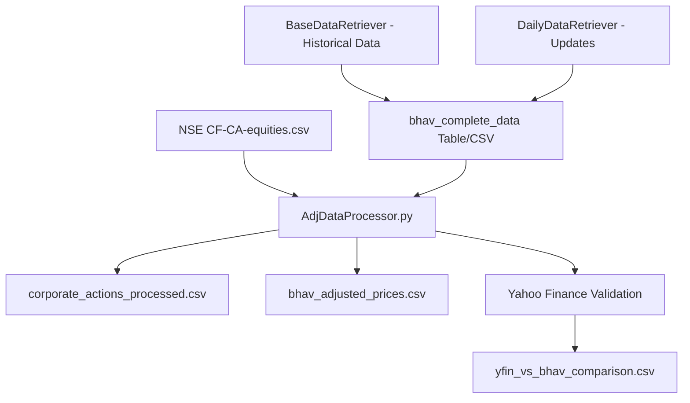

# NSE Adjusted Data Processor - AdjDataProcessor.py

A module for processing corporate actions and calculating adjusted stock prices with Yahoo Finance validation for NSE (National Stock Exchange) BHAV historical data.

## 🎯 Overview

**AdjDataProcessor.py** handles corporate actions processing, calculates historically adjusted prices, and validates results against Yahoo Finance data.

### **Key Capabilities**:
- **Corporate Actions Processing**: Handles dividends, stock splits, bonus issues, and rights offerings
- **Adjusted Price Calculation**: Computes cumulative adjustment factors for historical price data
- **Yahoo Finance Validation**: Comprehensive comparison with YFinance
- **Flexible Data Sources**: Works with both database tables and CSV files


## 📁 Module Architecture

```
Code/
├── AdjDataProcessor.py         # Corporate actions & adjusted prices processor 
├── data/
│   ├── CF-CA-equities.csv     # Input: NSE corporate actions data (required)
│   ├── eod.duckdb             # Historical price database (required)
│   ├── bhav_complete_data.csv # Historical price CSV
│   ├── corporate_actions_processed.csv    # Output: Processed corporate actions
│   ├── bhav_adjusted_prices.csv          # Output: Adjusted price data
│   └── yfin_vs_bhav_comparison_*.csv     # Output: Validation comparison
└── requirements.txt          
```

#### **Data Processing Pipeline**:
1. **Data Loading**: Reads NSE corporate actions CSV with error handling
2. **Date Parsing**: Converts EX-DATE from DD-MMM-YYYY to standardized format
3. **Regex Parsing**: Extracts action details from PURPOSE column using advanced regex
4. **Type Classification**: Categorizes actions as dividend, bonus, split, or rights
5. **Data Validation**: Ensures data integrity and consistency

#### **Regex Pattern Matching**:
```python
# Dividend extraction: "rs 10" or "rs. 5.50"
match = re.search(r'rs?\s*(\d+(?:\.\d+)?)', purpose)

# Ratio extraction: "1:1", "1:2", "3:2" formats
match = re.search(r'(\d+):(\d+)', purpose)
```

#### **Corporate Actions Supported**:
- **Dividends**: Cash dividend amounts in rupees
- **Stock Splits**: Ratio-based splits (e.g., 1:2, 1:5)
- **Bonus Issues**: Bonus share ratios (e.g., 1:1, 3:2)
- **Rights Issues**: Basic rights issue identification

#### **Output Structure**:
```sql
CREATE TABLE corporate_actions (
    symbol VARCHAR,              -- Stock symbol (standardized)
    ex_date DATE,                -- Ex-dividend date
    action_type VARCHAR,         -- 'dividend', 'split', 'bonus', 'rights'
    dividend_amount DOUBLE,      -- Dividend amount in rupees
    bonus_ratio_from DOUBLE,     -- Bonus ratio numerator
    bonus_ratio_to DOUBLE,       -- Bonus ratio denominator
    split_ratio_from DOUBLE,     -- Split ratio old shares
    split_ratio_to DOUBLE,       -- Split ratio new shares
    PRIMARY KEY (symbol, ex_date, action_type)
);
```

#### **Adjustment Methodology**:

##### **Dividend Adjustment**:
```python
# Factor = (Previous Close - Dividend) / Previous Close
multiplier = (prev_close_price - dividend) / prev_close_price
```

##### **Stock Split Adjustment**:
```python
# Factor = New Shares / Old Shares
multiplier = split_to / split_from
# Example: 1:2 split → multiplier = 2/1 = 2.0
```

##### **Bonus Issue Adjustment**:
```python
# Factor = New Shares / (Existing + New Shares)
multiplier = bonus_to / (bonus_from + bonus_to)
# Example: 1:1 bonus → multiplier = 1/(1+1) = 0.5
```

## 📋 Input/Output Specifications

### **Input Requirements**:

#### **1. NSE Corporate Actions CSV (data/CF-CA-equities.csv)**:
```
Required Columns:
- SYMBOL         # Stock symbol (e.g., "RELIANCE")
- EX-DATE        # Ex-date in DD-MMM-YYYY format
- PURPOSE        # Action description with details
- SERIES         # Trading series (EQ, BE, etc.)

Example PURPOSE formats:
- "DIVIDEND - RS. 10 PER SHARE"
- "BONUS 1:1"
- "STOCK SPLIT FROM RS 10/- TO RS 5/-"
- "RIGHTS 1:3 @ RS 100"
```

#### **2. Historical Price Data**:
```sql
-- From bhav_complete_data table or CSV
Required Columns:
- SYMBOL, SERIES, DATE1
- PREV_CLOSE, OPEN_PRICE, HIGH_PRICE, LOW_PRICE
- LAST_PRICE, CLOSE_PRICE, AVG_PRICE
- TTL_TRD_QNTY, TURNOVER_LACS, NO_OF_TRADES
- DELIV_QTY, DELIV_PER
```

#### **3. Ticker Dictionary**:
```python
tickerDict = {
    'RELIANCE': 'RELIANCE.NS',      # NSE symbol to Yahoo Finance ticker
    'TCS': 'TCS.NS',                # User has to add at least one
    'INFY': 'INFY.NS'
}
```

### **Output Files**:

#### **1. corporate_actions_processed.csv**:
```
Processed corporate actions with standardized format
- symbol, ex_date, action_type
- dividend_amount, bonus_ratio_from, bonus_ratio_to
- split_ratio_from, split_ratio_to
```

#### **2. bhav_adjusted_prices.csv**:
```
Historical data with adjusted prices
- All original columns from bhav_complete_data
- ADJ_CLOSE_PRICE: Calculated adjusted closing price
- Maintains original price data for comparison
```

#### **3. yfin_vs_bhav_comparison_[symbols]_[dates].csv**:
```
Detailed validation comparison
- Yahoo Finance vs calculated prices
- Close price and adjusted close price differences
- Rounded values for practical comparison
- Symbol and date alignment
```

## 🚀 Usage Examples

### **Complete Processing Pipeline**:
```python
import duckdb
from AdjDataProcessor import DataPreProcessor

# Database connection (optional)
con = duckdb.connect(database='data/eod.duckdb', read_only=False)

# Configuration
fromDate = '2024-01-01'
toDate = '2024-12-31'
tickerDict = {
    'RELIANCE': 'RELIANCE.NS',
    'TCS': 'TCS.NS',
    'INFY': 'INFY.NS'
}

# Initialize processor
processor = DataPreProcessor(
    startDate=fromDate,
    endDate=toDate, 
    tickerDict=tickerDict,
    con=con
)

# Execute complete pipeline
processor.preprocess_data('data/CF-CA-equities.csv')

con.close()
```

### **CSV-Only Processing** (No Database):
```python
from AdjDataProcessor import DataPreProcessor

# Process without database connection
processor = DataPreProcessor(
    startDate='2024-01-01',
    endDate='2024-12-31',
    tickerDict={'RELIANCE': 'RELIANCE.NS'},
    con=None  # Will use CSV files
)

# Set global flag for CSV mode
CREATE_TABLES = False
processor.preprocess_data('data/CF-CA-equities.csv')
```


### **Symbol Filtering**:
```python
# Process only specific symbols
limited_ticker_dict = {'RELIANCE': 'RELIANCE.NS'}
processor = DataPreProcessor(tickerDict=limited_ticker_dict)
processor.preprocess_data()
# Only RELIANCE data will be processed and validated
```


## 🚨 Error Handling & Validation

### **Common Issues & Solutions**:

1. **Missing Corporate Actions File**:
   ```python
   # FileNotFoundError for CF-CA-equities.csv
   # Solution: Download NSE corporate actions data
   ```

2. **Database Connection Issues**:
   ```python
   # Requires existing bhav_complete_data table
   # Solution: Run BaseDataRetriever.py first to create database
   ```

## 🔄 Workflow Integration

### **Pipeline Position**:


### **Dependencies**:
- **Prerequisite**: BaseDataRetriever.py for historical price data
- **Input Data**: NSE corporate actions CSV file (manual download required)
- **Database**: DuckDB connection for table-based processing

### **Related Resources**:
- [NSE Corporate Actions](https://www.nseindia.com/companies-listing/corporate-filings-corporate-actions) - Official NSE corporate actions
- [Yahoo Finance API](https://pypi.org/project/yfinance/) - Validation data source
- [Pandas Documentation](https://pandas.pydata.org/docs/) - Data processing
- [DuckDB Documentation](https://duckdb.org/docs/) - Database operations
- [Python Regex](https://docs.python.org/3/library/re.html) - Pattern matching

---
