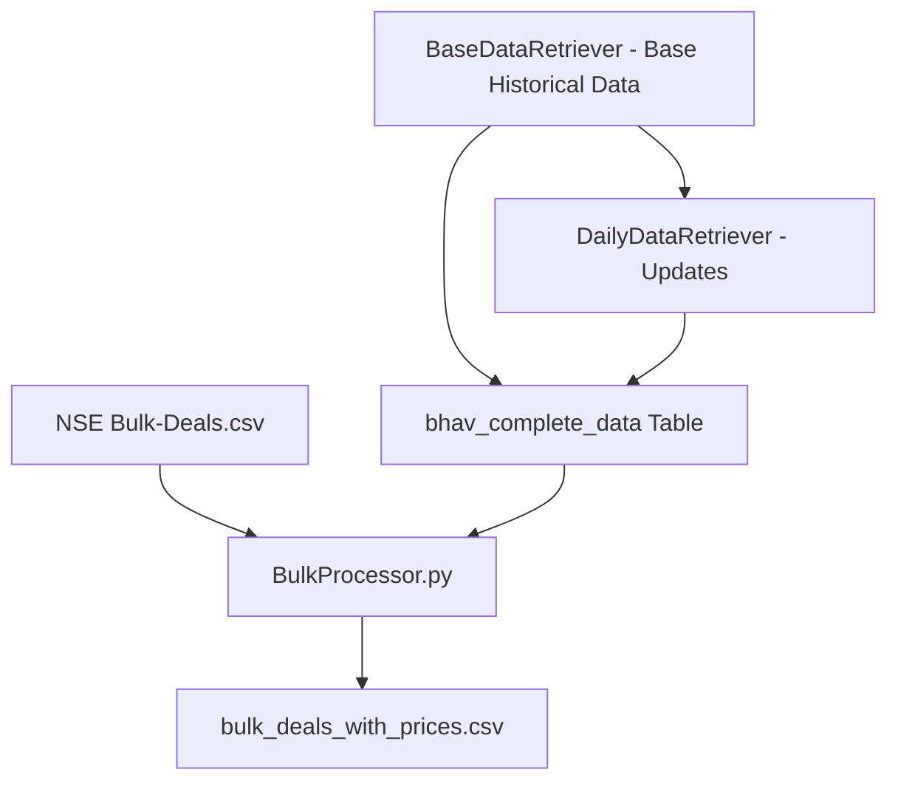

# NSE Bulk Deals Processor - BulkProcessor.py

A module for processing and analyzing NSE (National Stock Exchange) bulk trading transactions with market data integration.

## 🎯 Overview

**BulkProcessor.py** processes bulk deals data from NSE and integrates it with historical price data.

### **Key Capabilities**:
- **Bulk Deals Processing**: Processes NSE bulk deals CSV data with data cleaning
- **Price Integration**: Joins bulk deals with historical BHAV price data 

## 📁 Module Architecture

```
Code/
├── BulkProcessor.py            # Standalone bulk deals processor 
├── data/
│   ├── Bulk-Deals.csv          # Input: NSE bulk deals data (required)
│   ├── eod.duckdb              # Required: Historical price database
│   └── bulk_deals_with_prices.csv  # Output: Processed analysis results
└── requirements.txt           
```

## 📊 Core Functionality

### **Purpose**: Transform raw NSE bulk deals data

### **Data Processing Pipeline**:
1. **Data Ingestion**: Loads and validates NSE bulk deals CSV
2. **Data Cleaning**: Handles formatting, data types, and missing values
3. **Database Integration**: Joins with historical BHAV price data
4. **Results Export**: Outputs comprehensive analysis as CSV


### **Columns for final csv**:

#### **Market Data Indicators (Calculated)**:
- **is_greater**: Proportion indicating positive price movement (Close > Open)
- **is_open_equal_low**: Proportion indicating strong opening (Open == Low)

#### **Trading Metrics**:
- **Quantity_Traded**: Aggregated bulk deal quantities per symbol/date
- **Trade_Price_Avg_Price**: Average weighted bulk deal price
- **Volume Comparison**: Bulk deal quantity vs total market quantity

#### **Price Integration**:
- **OHLC Data**: Complete price information from historical data
- **Delivery Metrics**: Delivery quantity and percentage
- **Turnover Analysis**: Market turnover in lakhs

## 📋 Input/Output Specifications

### **Input Requirements**:

#### **1. NSE Bulk Deals CSV (data/Bulk-Deals.csv)**:
```
Expected Columns:
- Date                        # Trading date (DD-MMM-YYYY format)
- Symbol                      # Stock symbol
- Security Name               # Company name
- Client Name                 # Trading entity
- Buy / Sell                  # Transaction direction
- Quantity Traded             # Number of shares (with commas)
- Trade Price (Wght Avg Price) # Weighted average price
- Remarks                     # Additional information
```

#### **2. Historical Price Database (data/eod.duckdb)**:
```sql
Required Table: bhav_complete_data
-- Must contain historical price data for symbol/date matching
-- Created by BaseDataRetriever.py and/or DailyDataRetriever.py
```

### **Output Structure**:

#### **bulk_deals_with_prices.csv**:
```
Columns:
- Symbol                  # Stock symbol
- Date                    # Trading date
- Quantity_Traded         # Total bulk deal quantity
- Trade_Price_Avg_Price   # Average bulk deal price
- PREV_CLOSE              # Previous day closing price
- OPEN_PRICE              # Opening price
- HIGH_PRICE              # Highest price
- LOW_PRICE               # Lowest price
- LAST_PRICE              # Last traded price
- CLOSE_PRICE             # Closing price
- AVG_PRICE               # Average traded price
- TTL_TRD_QNTY           # Total market quantity
- TURNOVER_LACS          # Market turnover in lakhs
- NO_OF_TRADES           # Number of trades
- DELIV_QTY              # Delivery quantity
- DELIV_PER              # Delivery percentage
- is_greater             # Market sentiment indicator (0-1)
- is_open_equal_low      # Opening strength indicator (0-1)
```


## 🚨 Error Handling & Validation

### **Common Issues & Solutions**:

1. **Missing Input File**:
   ```python
   # FileNotFoundError: data/Bulk-Deals.csv not found
   # Solution: Ensure NSE bulk deals CSV is downloaded and placed correctly
   ```

2. **Database Connection Issues**:
   ```python
   # Requires existing bhav_complete_data table
   # Solution: Run BaseDataRetriever.py first to create database
   ```

## 🔄 Workflow Integration

### **Pipeline Position**:


### **Dependencies**:
- **Prerequisite**: BaseDataRetriever.py must be run first to create bhav_complete_data table
- **Input Data**: NSE bulk deals CSV file (manual download)
- **Database**: Active DuckDB connection with historical price data
- **Output**: Standalone CSV file for further analysis

### **Related Resources**:
- [NSE Bulk Deals Data](https://www.nseindia.com/companies-listing/corporate-filings-bulk-deals) - Official NSE bulk deals
- [Pandas Documentation](https://pandas.pydata.org/docs/) - Data processing
- [DuckDB Documentation](https://duckdb.org/docs/) - Database operations  
- [NSE Trading Guidelines](https://www.nseindia.com/) - Bulk deal regulations

---
