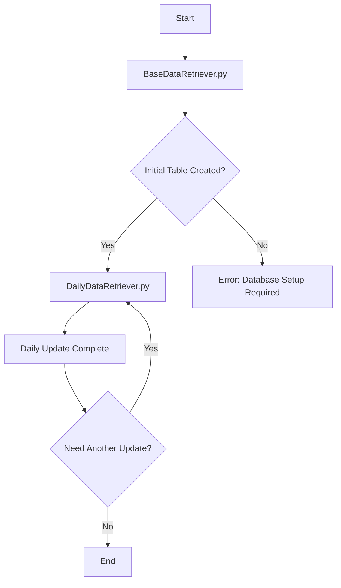

# NSE Data Retriever Modules - BaseDataRetriever & DailyDataRetriever

Data retrieval modules for downloading and processing NSE (National Stock Exchange) historical data.

## 🎯 Overview

This document covers two data retrieval modules:

- **BaseDataRetriever.py**: Complete historical data initialization and bulk processing
- **DailyDataRetriever.py**: Incremental daily updates - useful for updating the database 


## 📁 Module Architecture

```
Code/
├── BaseDataRetriever.py        # Initial setup & historical data processing 
├── DailyDataRetriever.py       # Incremental updates 
├── data/                       # Data storage structure
│   ├── bhav/                   # Historical BHAV price data
│   ├── sec_del/                # Securities delivery data
│   ├── bhav_sec/               # Securities BHAV data (CSV format)
│   ├── eod.duckdb              # Optional DuckDB database
│   └── bhav_complete_data.csv  # Final consolidated dataset
└── requirements.txt            
```

## 🔄 Module Relationship & Workflow

### **BaseDataRetriever** → **DailyDataRetriever** Pipeline:

1. **Initial Setup**: BaseDataRetriever downloads and processes historical data
2. **Update and Sync**: DailyDataRetriever performs incremental updates
3. **Data Continuity**: Automatic date range detection for seamless updates
4. **Database Integration**: Both modules work with DuckDB backend where the final table is stored

## 📊 BaseDataRetriever.py - Historical Data Foundation

### **Purpose**: Complete historical data initialization and bulk processing

### **Key Features**:
- **Multi-Format Support**: Processes old BHAV CSV files and new securities data. Prior to 2020, BHAV data was split into BHAV and SEC_DEL data. After the introduction of BHAV_SEC data (which combined both), BHAV was discontinued post July 2024. The code handles this by giving preferance to BHAV_SEC data whenever possible, and merges BHAV and SEC_DEL data for other dates to create a continuous and uniform dataset.
- **Data Consolidation**: Merges BHAV price data with securities delivery (SEC_DEL) information  
- **Comprehensive Validation**: Data cleaning, duplicate removal, and format consistency
- **Automatic ZIP Extraction**: Handles compressed NSE files
- **Error Resilience**: Continues processing despite individual file failures
- **Progress Tracking**: Detailed logging of downloads, skips, and missed dates
- **Rate Limiting**: Configurable sleep intervals to respect NSE server limits
- **Duplicate Removal**: Multiple levels of duplicate detection
- **Type Conversion**: Proper numeric type assignment with error handling

## 📈 DailyDataRetriever.py - Incremental Updates

### **Purpose**: Data synchronization and incremental processing 

**Prerequisites**: DailyDataRetriever.py requires BaseDataRetriever.py to be run once to create the initial table.

### **Key Features**:
- **Smart Date Detection**: Automatically determines latest data date from database
- **Incremental Downloads**: Downloads only missing data since last update
- **Database Integration**: Direct integration with existing bhav_complete_data table
- **Conflict Resolution**: Prevents duplicate insertion 

## 🔧 Configuration & Usage
### **Execution Flow**:



## 📋 Data Output Structure

### **File Outputs**:
- **data/bhav_complete_data.csv**: Final consolidated dataset
- **data/bhav/**: Historical BHAV CSV files (cm*bhav.csv)
- **data/sec_del/**: Securities delivery files (MTO_*.DAT)  
- **data/bhav_sec/**: Modern securities data (CSV format)

### **Database Schema**:
```sql
CREATE TABLE bhav_complete_data (
    SYMBOL         VARCHAR,     -- Stock symbol (trimmed, validated)
    SERIES         VARCHAR,     -- Trading series (EQ, BE, etc.)
    DATE1          DATE,        -- Trading date
    PREV_CLOSE     DOUBLE,      -- Previous closing price
    OPEN_PRICE     DOUBLE,      -- Opening price
    HIGH_PRICE     DOUBLE,      -- Highest price
    LOW_PRICE      DOUBLE,      -- Lowest price
    LAST_PRICE     DOUBLE,      -- Last traded price
    CLOSE_PRICE    DOUBLE,      -- Closing price
    AVG_PRICE      DOUBLE,      -- Average traded price
    TTL_TRD_QNTY  BIGINT,      -- Total traded quantity
    TURNOVER_LACS  DOUBLE,      -- Turnover in lakhs
    NO_OF_TRADES   BIGINT,      -- Number of trades
    DELIV_QTY     BIGINT,      -- Delivery quantity
    DELIV_PER     DOUBLE,      -- Delivery percentage
    PRIMARY KEY (SYMBOL, SERIES, DATE1)
);
```


## 🔄 Workflow Integration

### **Related Resources**:
- [NSE Official Website](https://www.nseindia.com/) - Data source
- [FastBT Library](https://github.com/ubertrade/fastbt) - NSE URL patterns
- [Pandas Documentation](https://pandas.pydata.org/docs/) - Data processing
- [DuckDB Documentation](https://duckdb.org/docs/) - Database operations

---

